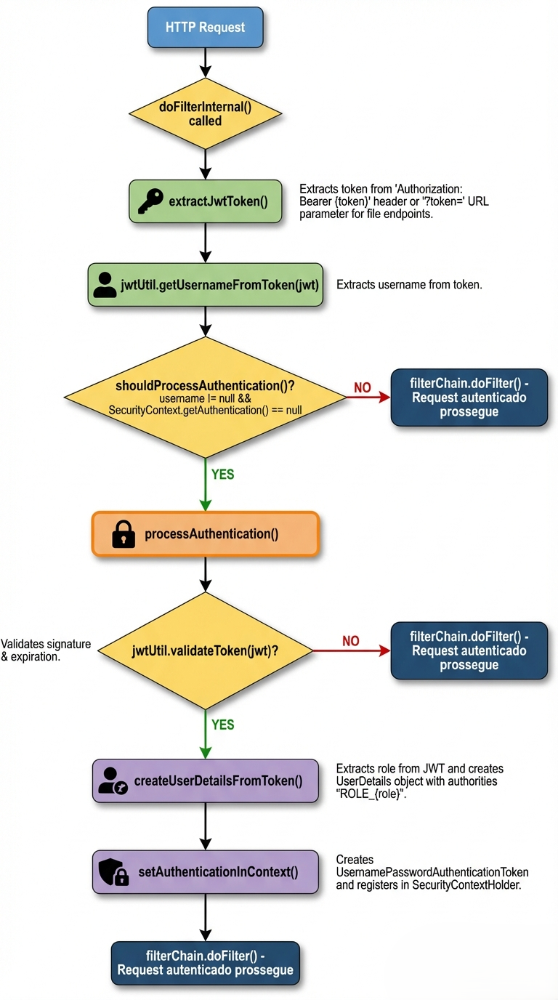

## 🎞️ JAVA FLIX 

#### Status do Projeto: `em desenvolvimento....👨‍💻`

### 📑 Sobre
Este projeto é o back-end de uma plataforma de streaming inspirada na Netflix, desenvolvida para consolidar conceitos avançados de desenvolvimento web. O foco principal é na implementação de uma arquitetura escalável, segura e com uma experiência de usuário (UX) fluida.

### 🛠️ Tecnologias e Ferramentas:

### ❇️Conceitos de Desenvolvimento para colocar em prática:

- **Arquitetura Restful:** Implementação de endpoints seguindo as melhores práticas de verbos HTTP e status codes.

- **Spring Security & JWT:** Autenticação e autorização stateless para garantir a segurança dos dados dos usuários.

- **Tratamento de Exceções:** Criação de um `GlobalExceptionHandler` para respostas de erro padronizadas.

- **Persistência de Dados:** Uso de Spring Data JPA para modelagem de relacionamentos complexos (Muitos-para-Muitos, etc).

- **Caching:** Implementação de cache para otimizar a listagem de categorias e filmes mais vistos.

### 📁 Estrutura de Pastas
- `config`: Configurações globais do Spring e Segurança.
- `dao`: Camada de persistência (Repositories).
- `dto`: Objetos de transferência de dados (Request/Response).
- `entity`: Modelos de dados mapeados para o banco de dados.
- `exception`: Tratamento global de erros e exceções customizadas.
- `security`: Lógica de geração, validação e filtragem de tokens JWT.

## Arquitetura de Segurança

O sistema utiliza **Spring Security** com **JWT (JSON Web Token)** para garantir a autenticação stateless e a proteção dos recursos.

### Fluxo de Autenticação
O `JwtAuthenticationFilter` é o componente central que intercepta as requisições. Ele foi projetado para suportar tanto aplicações web tradicionais quanto streaming de vídeo, permitindo a passagem do token via Header ou Query Parameter.

#### Detalhes do Filtro:
1. **Extração Inteligente**: Busca o token no Header `Authorization` ou no parâmetro `?token=` (necessário para mídias).
2. **Validação**: Verifica a assinatura e a expiração via `JwtUtil`.
3. **Contexto de Segurança**: Se válido, as permissões (`Roles`) são carregadas no `SecurityContextHolder`.
4. **Tratamento de Erros**: Falhas de autenticação são capturadas pelo `GlobalExceptionHandler`, retornando respostas padronizadas.
